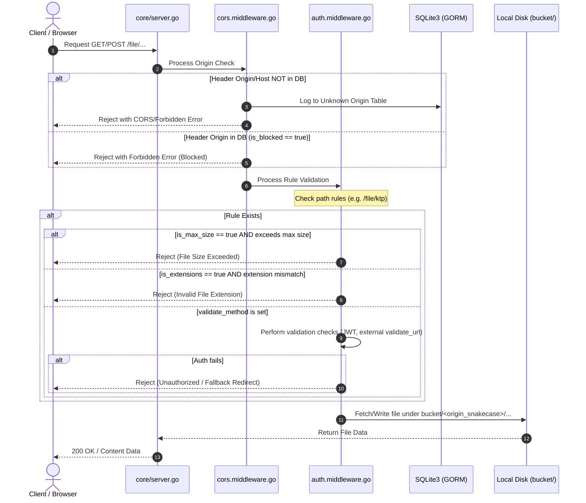

# AGENT.md — Operational Instructions and Guidelines for AI Agents

Welcome, Agent. This document contains the operational rules, codebase architecture, and UI/UX design specifications for **LumbungFS**. Refer to this guide before writing any backend or frontend code.

---

## 1. Project Overview & Technology Stack

LumbungFS is a self-hosted, lightweight, and high-performance multi-tenant/multi-domain object storage server featuring a custom routing/rules engine and a premium administrative dashboard.

### Core Stack
- **Backend**:
  - Language: **Go (Golang)** using the standard `net/http` library (no external router frameworks like Gin/Fiber unless explicitly requested).
  - Database: **SQLite3** without CGO, managed via **GORM** ORM.
  - Auth: **JWT** for API/UI dashboard authentication; Admin credentials verified against [password.txt](file:///Users/jefripunza/Documents/Projects/lumbung-fs/bucket/password.txt) (MD5 hash).
- **Frontend**:
  - Framework: **Vue 3** (Composition API, `<script setup>` with **TypeScript**).
  - State Management & Queries: **Pinia** for client state, and **Pinia Colada** (`@pinia/colada`) for asynchronous query/mutation state.
  - Data Fetching: **Axios** for API requests.
  - Styling: **Tailwind CSS v4** (using CSS custom properties / theme variables).
  - Aesthetics: "Operate" Theme (Light mode, scientific herbarium notebook styling, flat/bordered elements).
  - **Design Strictness**: All UI developments MUST strictly adhere to the guidelines in [DESIGN.md](file:///Users/jefripunza/Documents/Projects/lumbung-fs/DESIGN.md), [design-token.json](file:///Users/jefripunza/Documents/Projects/lumbung-fs/design-token.json), and [global.css](file:///Users/jefripunza/Documents/Projects/lumbung-fs/web/src/global.css).

---

## 2. Directory & File Structure

Ensure all new files and directories follow this layout strictly. Do not clutter the root folder.

```text
lumbung-fs/
├── main.go                                         # Main entry point (only calls core.Start())
├── go.mod                                          # Go dependencies
├── PLAN.md                                         # High-level architecture and implementation phases
├── DESIGN.md                                       # Premium UI/UX dashboard prompt and token specs
├── AGENT.md                                        # AI agent system operation instructions (This file)
├── design-token.json                               # Raw Design Token definitions
├── bucket/                                         # Physical file store & Database directory
│   ├── data.db                                     # SQLite3 database (GORM)
│   ├── password.txt                                # User credentials (MD5 hash of admin:admin)
│   └── <origin_snakecase>/                         # Directories grouped by origins (recursive structure)
├── core/
│   ├── server.go                                   # Main server initialization (database, routers, server start)
│   ├── database/
│   │   └── gorm.database.go                        # GORM database connection (Connect() function)
│   ├── variables/
│   │   └── path.variable.go                        # System-wide variables and path constants
│   ├── middleware/
│   │   ├── cors.middleware.go                      # Origin verification and CORS handling
│   │   └── auth.middleware.go                      # Rule checks and authorization flow
│   └── modules/
│       ├── routes.go                               # Registry for routing modules
│       ├── origin/
│       │   ├── model/
│       │   │   ├── origin.model.go                 # Origin model structure (GORM)
│       │   │   └── unknown_origin.model.go         # UnknownOrigin model structure (GORM)
│       │   ├── origin.handler.go                   # Handlers for CRUD Origin
│       │   └── origin.router.go                    # Routers for Origin module
│       ├── rule/
│       │   ├── model/
│       │   │   ├── rule.model.go                   # Rule model structure (GORM)
│       │   │   └── rule_file.model.go              # Association model for rules (if needed)
│       │   ├── rule.handle.go                      # Handlers for CRUD Rules & Rule checks
│       │   └── rule.router.go                      # Routers for Rule module
│       └── file-explorer/
│           ├── file_explorer.handler.go            # File uploading, downloading, listing, and folder creation
│           └── file-explorer.router.go             # Routers for browsing/uploading/downloading
└── web/                                            # Frontend Vue 3 + Tailwind CSS source
    ├── src/
    │   ├── global.css                              # Tailwind CSS custom @theme properties
    │   ├── main.ts                                 # App entry point
    │   └── components/                             # Reusable premium components
```

---

## 3. Core System Logic & Request Lifecycle

Every file request targeting `/file/...` must undergo verification checks.



### Path & Directory Naming Rule
1. Resolve the domain name from the request (`Origin` or `Host` header).
2. Look it up in the database. If found, convert the domain name to `snake_case` (e.g., `domain1.com` -> `domain1_com`).
3. Access disk at `./bucket/<origin_snakecase>/[subpaths]/[uuidv7].[extension]`.
4. Create parent directories on the fly using `os.MkdirAll` before saving.
5. Auto-rename uploaded files using UUIDv7 while preserving original extensions.

---

## 4. Database Schema Specifications

Backend GORM models must match these definitions:

### Origin Model
- `id` (UUIDv7, Primary Key)
- `domain` (string, Unique)
- `is_blocked` (boolean)

### UnknownOrigin Model (Traffic logger for unregistered domains)
- `id` (UUIDv7, Primary Key)
- `domain` (string)
- `access_at` (datetime)
- `ip_address` (string)

### Rule Model
- `id` (UUIDv7, Primary Key)
- `origin_id` (UUIDv7, Foreign Key to Origin)
- `path` (string, e.g. "ktp" matching "/file/ktp")
- `validate_method` (string/JSON array, e.g., jwt, header, cookie)
- `validate_url` (string, external HTTP verification endpoint)
- `validate_fallback_url` (string, optional backend fallback template)
- `is_max_size` (boolean)
- `value_max_size` (integer)
- `value_unit_size` (string: KB, MB, GB)
- `is_extensions` (boolean)
- `value_extensions` (string, comma-separated, e.g., "png,jpg,jpeg")

---

## 5. UI/UX Design System Guidelines

The frontend must use the **Operate** design system: a flat, botanical-scientific, light-mode, and information-dense layout.

### Color Tokens
Use these Tailwind utility/theme classes or CSS variables defined in [global.css](file:///Users/jefripunza/Documents/Projects/lumbung-fs/web/src/global.css):
- Canvas / Page background: `--color-sage-paper` (`#e0e0e0`)
- Primary Text & Icons: `--color-forest-ink` (`#09352e`)
- Card Background: `--color-bone-white` (`#ffffff`)
- Structural Borders / Gridlines: `--color-lichen` (`#cad3d2`)
- Fills / Halos: `--color-muted-sage` (`#77aa83`)
- Primary Filled Action (Buttons): `--color-moss` (`#85c093`)
- Links / Green accents: `--color-deep-fern` (`#007010`) or `--color-pine` (`#117025`)
- Secondary Metadata: `--color-slate-smoke` (`#6c7a79`)
- Dark Recessed Fills / Rare dark panels: `--color-charcoal-bark` (`#29211e`)

### Typography
Three primary fonts must be used (mapped to system sans fallback):
1. **denim** (`--font-denim`): Body copy, headings, UI text. Medium (500) for emphasis, Regular (400) for body text.
2. **muoto** (`--font-muoto`): Captions, labels, micro-copy, tick text. Tight negative tracking, compact and instrument-like.
3. **cinetype** (`--font-cinetype`): Uppercase-only badges, axis titles, stamp-like indicators. Wide tracking (+0.30em).

### Aesthetics Rules (Do's & Don'ts)
- **Do**:
  - Keep the background to Sage Paper (`#e0e0e0`) edge-to-edge.
  - Set card border-radius to 12px and tag border-radius to 4px.
  - Use 0.5px inset hairline borders (`border-[0.5px] border-lichen`) for cards instead of drop shadows.
  - Frame major UI sections as charts by placing bracket axis labels at the margins: e.g. `[ Chaos ]` and `[ Clarity ]` in muoto 12px.
  - Wrap inline text links in square brackets (e.g. `[ View Details ]`).
- **Don't**:
  - Do not introduce drop shadows stronger than 6% opacity.
  - Do not use Moss (`#85c093`) for more than one primary button per screen. Secondary actions must be outlined or ghost.
  - Do not use cinetype for long sentences or body copy.
  - Do not put data points inside cards; scatter points, charts, and connection paths must sit directly on the Sage Paper canvas to make the page behave like a chart.

---

## 6. Agent Operational Guidelines

When executing development tasks in this repository, follow these protocols:

### A. Code Integrity & Formatting
- **Go**: Use standard formatting (`go fmt`). Always compile and run `go vet` to check for concurrency or structural issues. Ensure database interactions use non-CGO SQLite driver (`modernc.org/sqlite` is preferred for pure Go).
- **Vue / TypeScript**: Write components using the Vue 3 Composition API with `<script setup lang="ts">`. Keep components small and split them into the `web/src/components` folder. Ensure Tailwind v4 properties are strictly utilized.
- **Documentation**: Keep comments and docstrings intact. If a function signature is altered, update its respective docstring.

### B. Workspace Commands
- Backend dev server: Propose running `go run main.go` or using file-watchers if configured.
- Frontend dev server: Propose running `npm run dev` inside [web/](file:///Users/jefripunza/Documents/Projects/lumbung-fs/web) directory.

### C. Creating Changes & Plans
- Always double check [PLAN.md](file:///Users/jefripunza/Documents/Projects/lumbung-fs/PLAN.md) before writing code.
- If making significant design changes, log your workflow inside the tasks checklist.
- For commits, generate ultra-compressed caveman-style commit logs if stage triggers are active.
