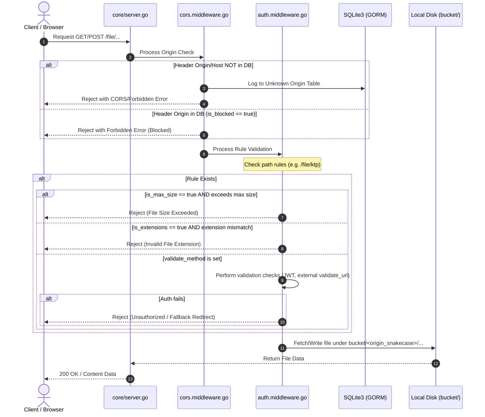

# LumbungFS - Architecture & Implementation Plan

LumbungFS is a self-hosted, lightweight, and high-performance multi-tenant/multi-domain object storage server. It features a Golang backend using the standard `net/http` package with JWT-based authentication, SQLite3 database managed via GORM, and a modern, premium Vue 3 + Tailwind CSS Web UI Dashboard.

---

## 1. System Request Flow

Below is the request lifecycle for serving and validating requests in LumbungFS:



---

## 2. File & Folder Directory Structure

```text
lumbung-fs/
├── main.go                                         # Main entry point (only calls core.Start())
├── go.mod                                          # Go dependencies
├── PLAN.md                                         # High-level architecture and implementation phases
├── bucket/                                         # Physical file store & Database directory
│   ├── data.db                                     # SQLite3 database (GORM)
│   ├── password.txt                                # User credentials (MD5 hash of admin:admin)
│   └── <origin_snakecase>/                         # Directories grouped by origins (recursive structure)
├── core/
│   ├── server.go                                   # Main server initialization (database, routers, server start)
│   ├── database/
│   │   └── gorm.database.go                        # GORM database connection (Connect() function)
│   ├── variables/
│   │   └── path.variable.go                        # System-wide variables and path constants
│   ├── middleware/
│   │   ├── cors.middleware.go                      # Origin verification and CORS handling
│   │   └── auth.middleware.go                      # Rule checks and authorization flow
│   └── modules/
│       ├── routes.go                               # Registry for routing modules
│       ├── origin/
│       │   ├── model/
│       │   │   ├── origin.model.go                 # Origin model structure (GORM)
│       │   │   └── unknown_origin.model.go         # UnknownOrigin model structure (GORM)
│       │   ├── origin.handler.go                   # Handlers for CRUD Origin
│       │   └── origin.router.go                    # Routers for Origin module
│       ├── rule/
│       │   ├── model/
│       │   │   ├── rule.model.go                   # Rule model structure (GORM)
│       │   │   └── rule_file.model.go              # Association model for rules (if needed)
│       │   ├── rule.handle.go                      # Handlers for CRUD Rules & Rule checks
│       │   └── rule.router.go                      # Routers for Rule module
│       └── file-explorer/
│           ├── file_explorer.handler.go            # File uploading, downloading, listing, and folder creation
│           └── file-explorer.router.go             # Routers for browsing/uploading/downloading
└── web/                                            # Frontend Vue 3 + Tailwind CSS source
```

---

## 3. System Architecture & Core Database Schema

LumbungFS is designed to serve files for multiple domains (origins) from a single backend service, with custom validation rules and traffic analysis.

### SQLite Database (`./bucket/data.db`)

We will use GORM to manage the following tables:

#### **Origin Table** (Allowed domains)

- `id` (UUIDv7, Primary Key)
- `domain` (string, Unique)
- `is_blocked` (boolean)

#### **Unknown Origin Table** (Logged traffic for unregistered domains)

- `id` (UUIDv7, Primary Key)
- `domain` (string)
- `access_at` (datetime)
- `ip_address` (string)

#### **Rule Table** (Path-based rules for origins)

- `id` (UUIDv7, Primary Key)
- `origin_id` (UUIDv7, Foreign Key to Origin)
- `path` (string, e.g., "ktp" for "/file/ktp")
- `validate_method` (string/JSON array, e.g., jwt, header, cookie)
- `validate_url` (string, external HTTP verification endpoint)
- `validate_fallback_url` (string, optional backend fallback template)
- `is_max_size` (boolean)
- `value_max_size` (integer)
- `value_unit_size` (string: KB, MB, GB)
- `is_extensions` (boolean)
- `value_extensions` (string, comma-separated, e.g., "png,jpg,jpeg")

---

## 4. Component Implementation Details

### A. Main Entry & Server Bootstrapping
- **`./main.go`**: Minimalist. It only imports `./core` and calls `core.Start()`.
- **`./core/server.go`**:
  - Connects to SQLite3 database via `database.Connect()`.
  - Performs schema auto-migrations for GORM models.
  - Setup routing: UI dashboard endpoints and file serving routes.
  - Checks for `./bucket/password.txt` file (MD5 password checker). If missing, sets up `admin:admin` hash (`e10adc3949ba59abbe56e057f20f883e`).
- **`./core/database/gorm.database.go`**:
  - Configures GORM to connect to sqlite3 (`./bucket/data.db`) without using CGO.

### B. File Operations & Path Handling
- **File Access Pattern**: When a request queries `GET /file/user/ktp/uuid.jpeg` from origin `domain1.com`:
  1. Find origin domain in DB, convert to snake_case (`domain1_com`).
  2. Locate file on disk at `./bucket/domain1_com/user/ktp/uuid.jpeg`.
- **File Upload & Naming**:
  - Rename files to a generated `UUIDv7` string while keeping the original extension (e.g. `018f7c5e-88cc-75b2-baee-191b7d598583.png`).
  - Automatically create nested target directories recursively on disk before saving.

### C. CORS & Rules Middleware
- **Domain Verification Middleware**:
  - Validates if the request domain (`Origin` or `Host` header) is present in the `origin` database.
  - If not found: insert into `unknown_origin` logs, then return CORS Error.
  - If found but `is_blocked == true`: block access immediately.
- **Rule Verification Middleware**:
  - Analyzes the request path. If a rule exists for this path:
    - Perform request content size checks and file extension verification.
    - If `validate_method` is set, verify via `validate_url`.

### D. Frontend Management Dashboard
- Built with **Vue 3** + **Tailwind CSS**.
- **Features**:
  - Premium look (dark mode base, sleek card components, beautiful layout).
  - Admin login validation against password file (JWT authenticated session).
  - Tables to view allowed Origins and logs of Unknown Origins.
  - Interface to configure custom path rules for each domain.
  - Fully-functional **File Explorer** allowing users to create folders, upload files, browse structures, and download files.
